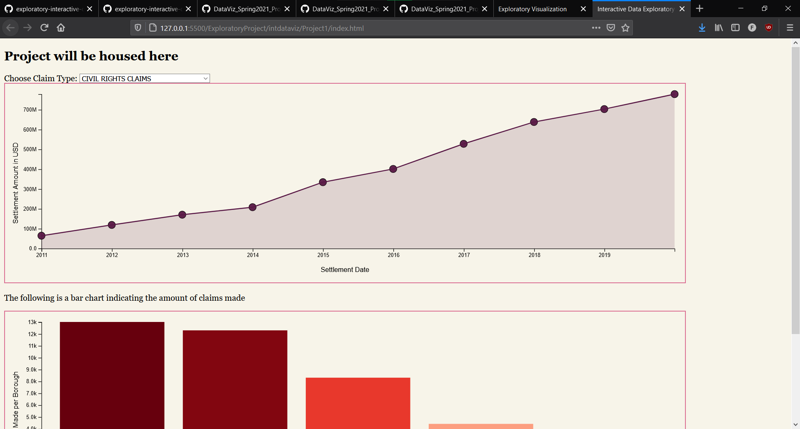
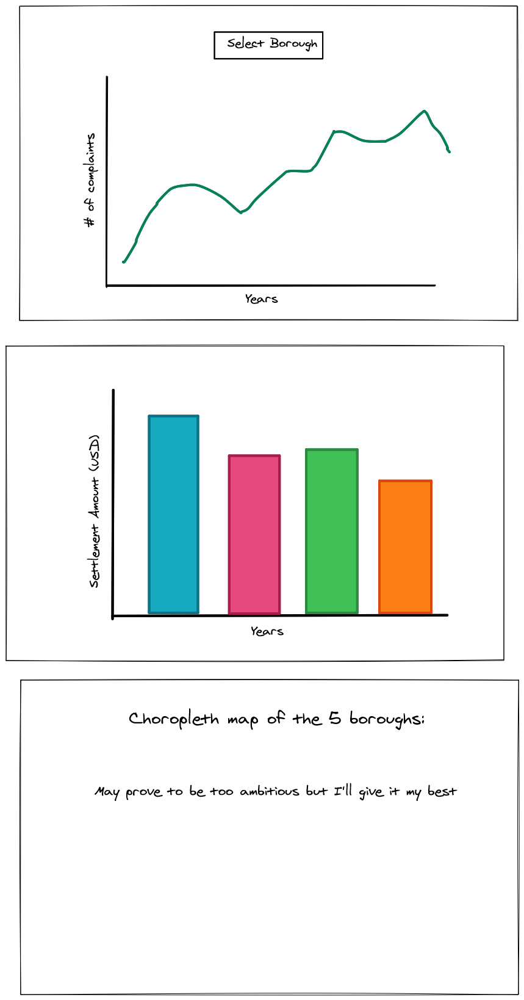

# Exploratory Project
 
For the exploratory project I will be working with NYC police settlement data and map the number of complaints from 2010 to 2019. I will incorporate line graphs, bar charts, and perhaps a map of NYC to help locate which areas/precincts had the most cumulative complaints. Sketch of what's to come is [here](https://excalidraw.com/#room=94f1b7be35b41ceb2877,jUU-p_QIYB7y_jh_IqUyRA)

## Updates Following Project Finalization:
After completing and finalizing my project, the text below will walk through my thought process, iterations, and changes made throughout the project. 

During the ideation process and initial sketches, I knew I wanted to work with bar charts and line graphs since these methods were the simplest ways to get my objective across to the audience. 

Data was obtained through FiveThirtyEight and the raw file had to be aggregated to individual files to better visualize. Data wrangling and consolidation was done through Excel using their statistical tools and formulas. Data with missing boroughs and missing claim types were omitted so that D3.js would have an easier time reading the information. 

The first step was to make sure that my data was mapping to the appropriate points in my SVG. Here is a screenshot of the first iteration:

After the critiques, I touched up the format and added the necessary context to help drive the story for my exploratory project. 

