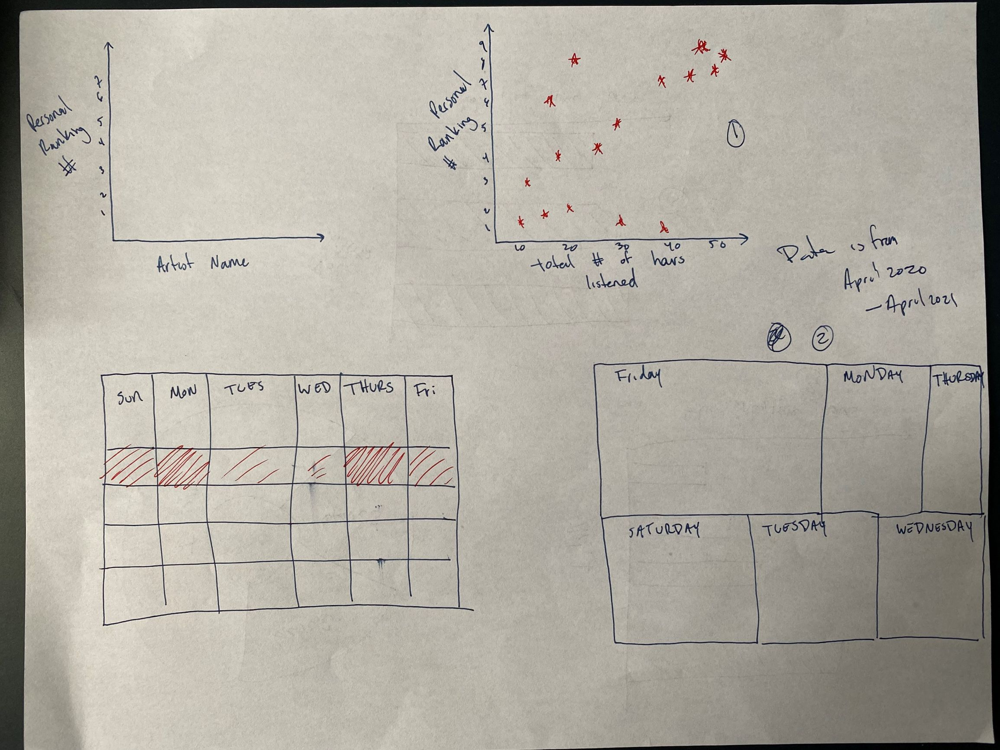
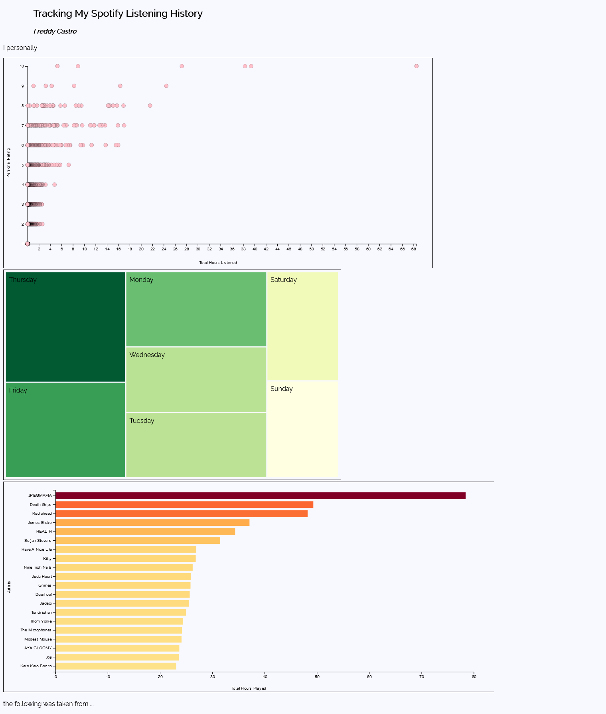

# Narrative Project

For my narrative project I will be mapping my Spotify listening history from April 2020 to April 2021. The purpose of this project is to see what my patterns are throughout the days and to rank each individual artist/band. The sketches below are ideas I plan to implement:

## Updates Following Project Finalization:

Data for this project was much more straightforward than the data handled in my exploratory project. The only forms of data wrangling done was consolidation using Excel. Formulas such as VLOOKUP and SUM were used to allocate all the statistical aspects of the data, as well as Excel’s own statistical tools. 

The data was obtained by contacting Spotify and requesting the files through their “Privacy Settings” page. 

During the critique I implemented more contextual change since at the time I was hoping that the graphs would be sufficient enough to deliver my message. The same format, as in layout of the webpage, was followed from my previous project. I did wish to have text on the left and the graphs on the right in a grid format but this proved to be to difficult to write in CSS. 

Here is the first iteration of the website:

I still wish to implement a calendar heat map to this project as discussed earlier, perhaps I will do this once the summer kicks off and I have more time to do my own research on how to code and map the calendar.